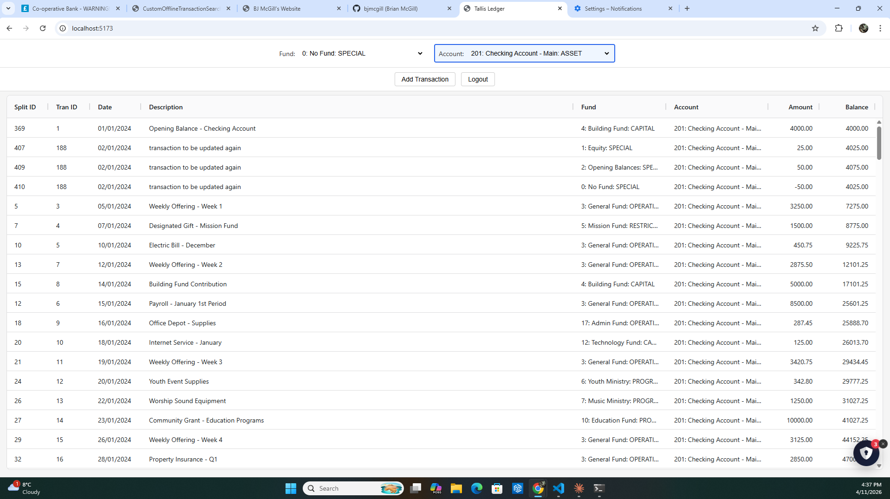

# Tallis-Ledger-Web

A concise ledger based web accounting system for small charities. This is a port of Tallis-Ledger into a React/Express Javascript web app.

It was vibe coded using the prompts INSTRUCTIONS*.md, plus a little tweaking.



You will need the following software installed on your computer :

```
node.js
git
MySQL
DBeaver
```

Once you have installed git you can clone the repository by entering :

```
git clone https://github.com/bjmcgill/Tallis-Ledger-Web
```

This will create a directory called Tallis-Ledger-Web in your current directory. Now type :

```
cd Tallis-Ledger-Web\server
npm install
```

This will load the necessary libraries

Now start the mysql server using whichever method works for the way you installed it.

Now all you need is to start the node.js server, and run the dev environment.

create a tab in Windows Terminal and type:

```
cd Tallis-Ledger-Web\server
npm start
```

Then create another tab, and type:

```
cd Tallis-Ledger-Web\client
npm run dev
```

keep these tabs running as you open a web browser with the url: http://localhost:5173/

I tried running the production version of this app in mydomain.com/accounts but unfortunately could not get it to work. Let me know if you can get it to run on a Wordpress server like Krystal Web Host, in public_html/accounts.

I got it working in localhost/accounts using the caddy web server, which is more user friendly than the Litespeed web server used by Krystal.

I then completely changed tack, and rewrote the program so that it would start with the url subdomain.mydomain.com without the accounts prefix. Starting with this commit, I then got it working on a vps running caddy, using this method. Use the previous commit from this change if you want to run it from localhost/accounts

Before you open the database you must create it with the commands:

```
mysql -u root -p -e "CREATE DATABASE database_name;"
mysql -u root -p database_name < create.sql
```

you can also populate it with sample data by typing:

```
mysql -u root -p database_name < data.sql
```

You can use DBeaver to populate the Funds and Accounts table, before you start entering your transactions.

## Welcome to Tallis Ledger Web

This program gives users the power and flexibility of double entry bookkeeping without the hassle of complicated accounting software like Sage and Gnucash. On opening the application (and selecting a valid database), you are met with a simple ledger window which you can filter on fund or account. There are three modes: Initial - Where you can add or select a transaction; Add - Where you can add a transaction; and Edit - Where you can select and edit a previous transaction.

Each transaction consists of two or more splits. The sum of all split amounts in a transaction will sum to zero. That is the double entry feature.

The Add and Edit modes give you the capability to cancel, save a transaction, add a split, delete a split, balance a split or delete a transaction.

Suppose you received a £100 from the council as a restricted grant. You would create a restricted income fund called "Council Fund", a "Council Income" account, and you would put the money in the Bank.

You would create the following rows in the Fund and Account tables using DBeaver

**Fund**

| Id | Name | Type |
|:---|:-----|:-----|
| 100 | Council Fund | Restricted Fund |

**Accounts**

| Id | Name | Type |
|:---|:-----|:-----|
| 100 | Bank | Current Asset |
| 200 | Council Income | Restricted Income |

Then you would enter the following double entry in the main ledger window

**Ledger**

| UserDate | Description | FundChoice | AccountChoice | Amount |
|:---------|:------------|:-----------|---------------|--------|
| 2025-07-22 | Grant from Council | Council Fund | Bank | 100 |
| 2025-07-22 | Grant from Council | No Fund | Council Income | -100 |

Note that the second split (row) in the ledger is negative. Money is coming from the income account and going into the bank account. The income is always negative because it is a credit, and the current asset is always positive because it is a debit. This is not what you might expect from looking at a bank statement, but bookkeepers always do it this way.

Once the Accounts and Fund have been entered into the tables using DBeaver, you will be able to select them in the ledger by means of a drop down box.

If you are still confused, I will write more extensive documentation for the application in this repository's wiki.

## Creating Reports

Tallis Ledger Web includes views which you can use to create reports on entered data.

You can launch DBeaver and you can select the views.

LedgerViewWithFundBalance shows all the transactions which have been entered partitioned by Fund, and containing a balance column.

If you only want to see the transactions for a particular fund you can enter the following sql and execute it within DBeaver:

```
SELECT * FROM LedgerViewWithFundBalance WHERE FundId=200
```

LedgerViewWithAccountBalance has the same functions as LedgerViewWithFundBalance but partitioned by Account.

If you want to list all the funds in your database and examine their balances you can use the view FundSummaryView.

AccountSummaryView has the same functionality as FundSummaryView but with respect to accounts.

Finally you can use the AccountTypeSummaryView to find the totals of transaction amounts grouped by AccountType.

Thankyou for choosing Tallis Ledger Web.

BJ McGill 11-04-2026
